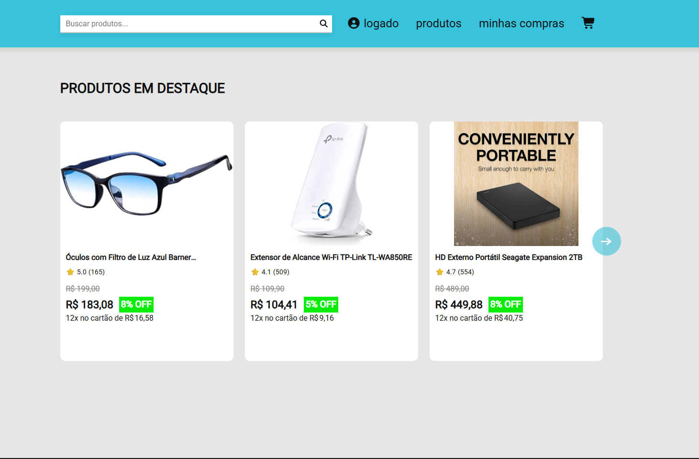

# Meu primeiro programa full-stack: E-commerce

Após pouco mais de cinco meses estudando programação, decidi criar um projeto que realmente me desafiasse. O objetivo era desenvolver uma aplicação completa que reunisse tudo o que eu havia aprendido até então e me obrigasse a enfrentar problemas que ainda não tinha resolvido.

O resultado foi um e-commerce simplificado desenvolvido com Node.js, Express e PostgreSQL no backend, e HTML, CSS e JavaScript no frontend. A aplicação conta com mais de oito telas, autenticação de usuários, catálogo de produtos, carrinho persistente, histórico de compras e diversas outras funcionalidades.

## Preview

## Deploy
Site disponível aqui https://ecommerce-ten-weld-12.vercel.app/index/index.html

## Funcionalidades

o site tem suporte para 

- Cadastro de usuários
- Login com autenticação JWT
- Carrinho persistente
- Histórico de compras
- Compra de produtos
- Pesquisa de produtos e filtro de resultados
- Responsividade para diferentes telas

## Tecnologias

### Frontend

- HTML
- CSS
- JavaScript

### Backend

- Node.js
- Express

### Banco de Dados

- PostgreSQL

### Deploy

- Railway
- Vercel

### Bibliotecas

- JWT
- bcrypt
- cookie-parser
- helmet
- zod
- winston

## Arquitetura

Para a organização no backend optei pelo padrão MVC usando um estilo Feature-based folder structure, ou seja todos os arquivos que pertenciam a uma funcionalidade específica ficam encapsulados dentro de uma única pasta, A mesma organização também foi aplicada ao frontend para manter uma estrutura consistente entre as duas partes da aplicação.

### Vantagens/Motivos dessa escolha

Fica bem mais fácil de achar e organizar o projeto, no inicio quando eram poucas pastas era indiferente mas depois de longos meses e cada vez mais arquivos acabou ficando confuso e estressante mexer no código

## Por que do uso dessas tecnologias?

### NodeJs

A escolha de node do backend veio pelo motivo de eu já estar familiarizado com tanto a sintaxe do javascript mas também com a minha experiência com a linguagem em outros projetos

### Postgres

Eu não tinha experiência em bancos antes do postgres ou seja foi a primeira vez que eu tive que modelar e programar usando um banco de dados. Escolhi PostgreSQL por ser um banco de dados relacional robusto, amplamente utilizado no mercado e por oferecer recursos avançados, como funções de agregação JSON, que facilitaram bastante a construção da API.
## Aprendizados

Antes mesmo de eu começar esse projeto eu nunca nem tinha feito um projeto com conexão backend com frontend, então entenda que o que eu aprendi com esse projeto foi basicamente tudo o que ele é por inteiro

Durante o desenvolvimento deste projeto eu aprendi:

- JWT
- Cookies HTTP Only
- PostgreSQL
- Deploy
- CORS
- Estrutura MVC
- Transações no banco
- Paginação
- Filtros
- Integração Frontend/Backend
- etc...

## Melhorias futuras (as principais por que tem muitas)

- Perfil do Usuário: Criação de uma página dedicada (perfil.html) para gerenciamento de dados da conta.
- Painel admin
- Paginação Eficiente: Substituir a paginação baseada em OFFSET por paginação baseada em cursor (Keyset Pagination) para melhor performance
- Busca Avançada: Melhorar o sistema de pesquisa no PostgreSQL para suportar consultas multi-palavras mais precisas.
- Detalhamento de Pedidos: Enriquecer a rota /compras consumindo dados relacionais da tabela de pedidos para exibir o histórico completo ao cliente.
